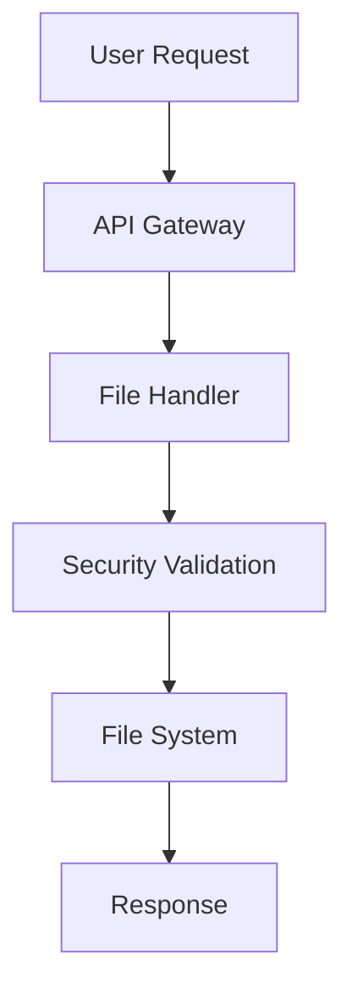

# Test Documentation

Welcome to the VeriDoc test documentation! This file is used to test the documentation browser functionality.

## Features

VeriDoc provides several key features:

- **Fast Documentation Access**: Sub-500ms startup time
- **Rich Markdown Rendering**: Tables, code blocks, and more
- **Mermaid Diagrams**: Interactive diagram support
- **Search Functionality**: Full-text search across files
- **Syntax Highlighting**: Code files with proper highlighting

## Code Example

Here's a simple Python example:

```python
def hello_world():
    """A simple greeting function"""
    print("Hello, VeriDoc!")
    
if __name__ == "__main__":
    hello_world()
```

## Table Example

| Feature | Status | Priority |
|---------|--------|----------|
| Markdown | ✅ Complete | High |
| Search | 🚧 In Progress | High |
| Terminal | 📋 Planned | Medium |

## Mermaid Diagram



## Lists

### Ordered List
1. First item
2. Second item  
3. Third item

### Unordered List
- Bullet point one
- Bullet point two
- Bullet point three

## Blockquote

> This is a blockquote example. VeriDoc renders blockquotes with a nice left border and background.

## Links

- [Internal link](../docs/specs/API_SPEC.md)
- [External link](https://github.com/anthropics/claude-code)

---

This is a test file to verify that VeriDoc is working correctly!